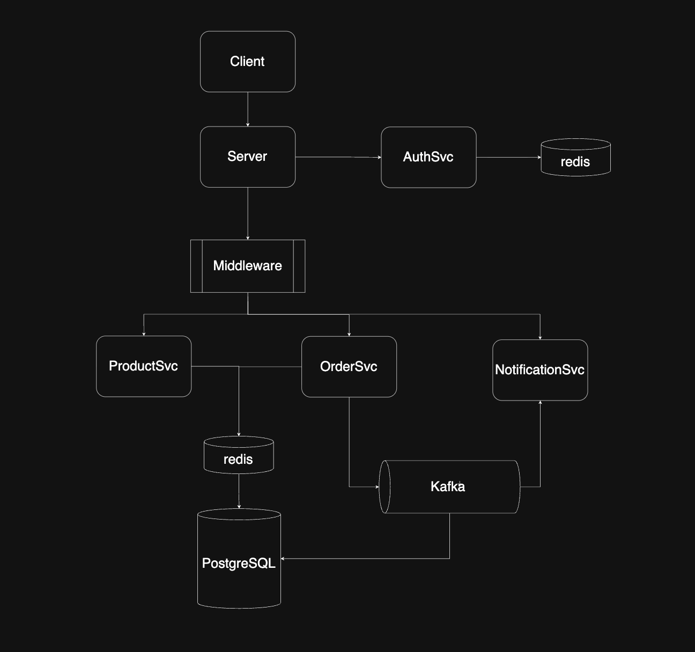
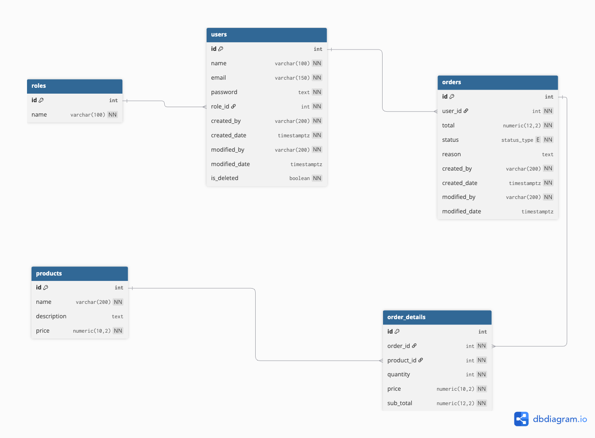

# go-ecomerce
<h1></h1>

<h2>Flow Diagram</h2>


<h2>ER Diagram</h2>



<h2>Tech stack</h2>

- [x] [Design Pattern >> Hexagonal Architecture]
- [x] [Web Server Framwork >> fiber/v2]
- [x] [Database >> PostgreSQL]
- [x] [Cache >> Redis]
- [x] [Queue >> Kafka]
- [x] [Notification >> Server Sent Event]


<h2>Setup Project</h2>

```bash
# images
docker pull redis
docker pull postgres
docker pull confluentinc/cp-zookeeper:7.5.0
docker pull confluentinc/cp-kafka:7.5.0

# env
BASEPATH = <>
PORT = <>
ACCESS_ORIGIN = <>
WEB_URL = <>
LOGIN_SUCCESS_REDIECT_PATH= <>
LOGIN_ERROR_REDIECT_PATH= <>
COOKIE_DOMAIN = <>
REDIS_SESSION_INDEX = <>
COOKIE_HTTPONLY = <>
COOKIE_SECURE = <>
COOKIE_SAMESITE = <>
COOKIE_SESSION_KEY = <>
USE_REDIS_SESSION = <>
POSTGRES_CONNECTION_STRING = <>
REDIS_USE_CLUSTER = <>
REDIS_HOST = <>
REDIS_PASSWORD = <>
REDIS_CACHE_INDEX = <>
KAFKA_BROKERS = <>
KAFKA_GROUP_ID = <>


# start container
docker-compose up -d
# stop container
docker-compose down -v
```


<h2>Run Start Project Command</h2>

```bash
# initial
go mod tidy

# run server
go run ./cmd/app-api .  
```


<h2>Spec API Swager JSON</h2>

- [x] [http://localhost:8080/api/docs]
